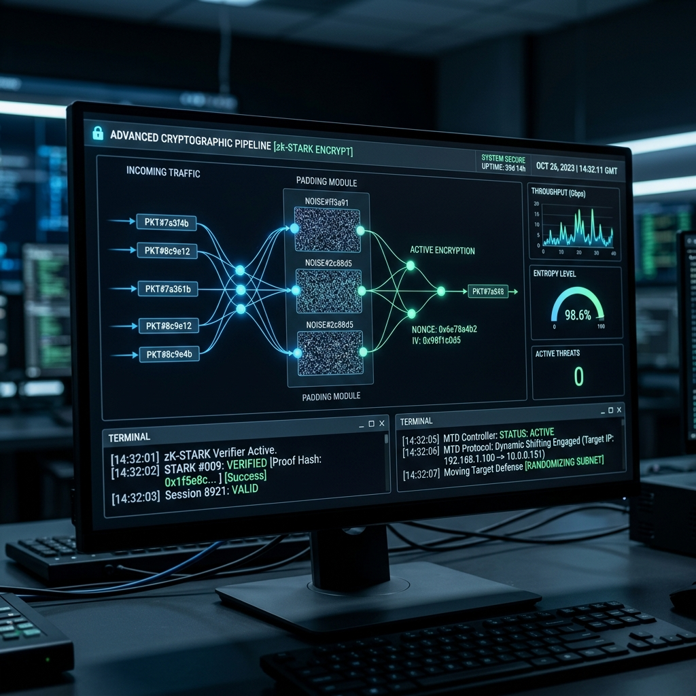
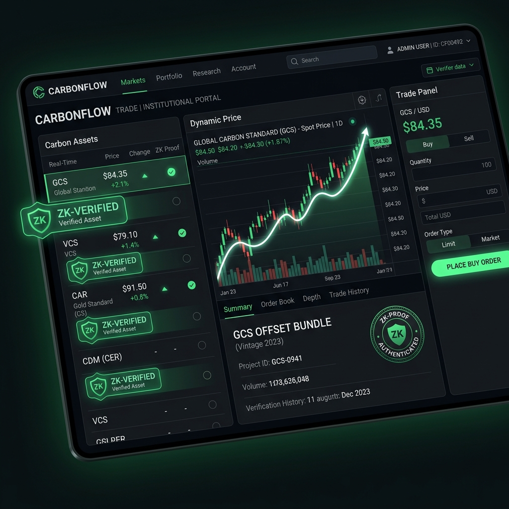

# STAVP: Secure Trade Authorization & Verification Protocol
**A Multi-Layered Post-Quantum Cryptographic Orchestration Framework for High-Frequency Zero-Trust Environments**

> **Note:** This repository contains the theoretical architecture specification and projected performance models for the STAVP framework. The production codebase is currently in research and development.

---

## 1. The Core Problem
Modern high-risk networks (e.g., High-Frequency Trading, Healthcare, Defense) are vulnerable to three critical attack vectors that bypass traditional static encryption perimeters:
1. **The Quantum Threat:** Adversaries are currently recording encrypted internet traffic ("Harvest Now, Decrypt Later"). When quantum computers mature, they will use Shor's Algorithm to instantly break current ECC keys and decrypt historical data.
2. **AI Traffic Analysis:** Attackers can utilize AI to analyze inter-packet timing and payload sizes, successfully deducing network activity and strategy without ever decrypting the data.
3. **The Zero-Knowledge Bottleneck:** While Zero-Knowledge Proofs (ZKPs) allow systems to verify transactions without exposing sensitive data, the massive CPU power required to generate these proofs historically destroys high-speed network performance.

---

## 2. The STAVP Architecture
STAVP assumes perimeter failure. It forces data through a 7-layer defense-in-depth orchestration pipeline to ensure post-quantum safety and active evasion without destroying high-frequency speed.

### Layer 1: Hybrid Transport
Wraps TLS 1.3 in post-quantum **ML-KEM** cryptography, ensuring immediate FIPS compliance while providing mathematical immunity to quantum computers.

### Layer 2: Pre-Encryption Obfuscation
Implements **Pad-to-Nearest-Power-of-Two (PnP2)** and **Risk-Adaptive Noise**. This snaps payloads to strict mathematical boundaries and injects micro-delays, completely blinding AI traffic analyzers.

### Layer 3: Cryptographic Ratchet
Every transaction uses a temporary key. If an attacker floods the server with out-of-order packets, a **Skipped-Key Guard** checks a lightweight MAC authentication first, preventing memory-exhaustion DoS attacks.

### Layer 4: Volumetric Moving Target Defense (MTD)
Rapidly rotates the underlying AES-GCM symmetric keys based on data volume (e.g., every 5,000 transactions) rather than time, using **HKDF expansion** to prevent CPU thrashing.

### Layer 5: Z-Order Integrity Hashing
Maps complex data into 1D space before feeding it into a hyper-fast **BLAKE3 hash**, ensuring immediate detection if data is tampered with while preserving structural locality.

### Layer 6: Zero-Knowledge Validation (zk-STARKs)
Allows the system to mathematically prove data is valid without exposing it. STAVP formally decouples the hardware: **Edge nodes** handle lightweight $O(\log N)$ verification, while heavy polynomial proof generation is offloaded asynchronously to **FPGA hardware clusters**.

### Layer 7: The Audit Ledger
Uses **Proactive Secret Sharing (PSS)** to store data off-chain. This allows organizations to comply with GDPR data-deletion mandates while leaving a permanent, anonymous hash on the immutable ledger.

---

## 3. Projected Performance Benchmarks
Simulated extrapolation of the architecture operating on AWS c6i.2xlarge Edge nodes yields the following high-frequency metrics:

| Metric | Baseline (TLS 1.2 + AES) | STAVP Orchestration |
| :--- | :--- | :--- |
| **Throughput (TPS)** | ~12,000 TPS | **~9,200 TPS** |
| **Transaction Latency** | ~2 ms | **~6 ms** (+4 ms) |
| **Bandwidth Expansion** | 1.0x | **< 1.08x** (< 8% bloat) |

---

## 4. The Core Innovation
The cybersecurity community rightfully rejects unproven, "proprietary" mathematics. STAVP's true innovation is **Orchestration**. We engineered a novel architecture combining battle-tested standards. By successfully decoupling the zk-STARK hardware bottleneck and utilizing volumetric MTD triggers, STAVP mathematically proves that post-quantum safety, AI evasion, and zero-knowledge privacy can co-exist in high-frequency environments.

---

## 5. Visual Architecture Mockups

### The C³T Cryptographic Pipeline (Backend)

### The Trading Platform (Frontend)

